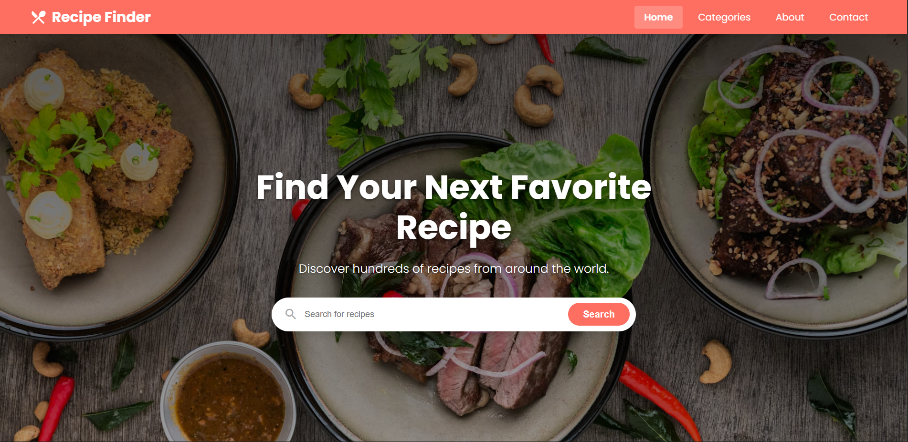
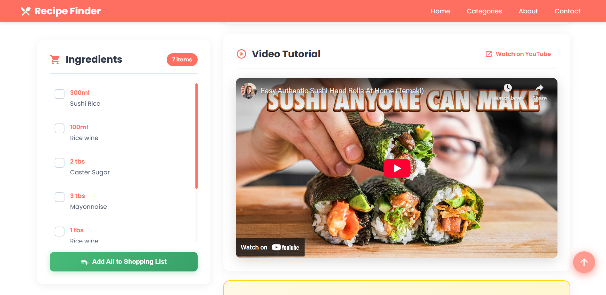
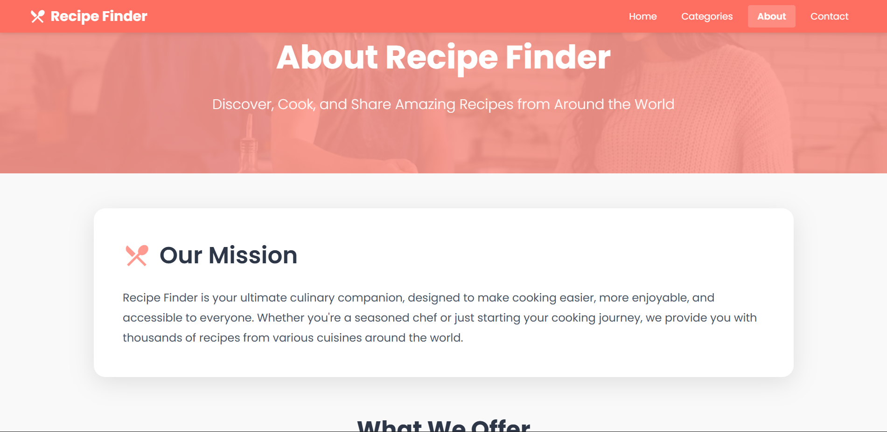
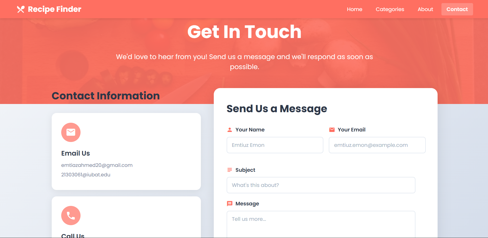
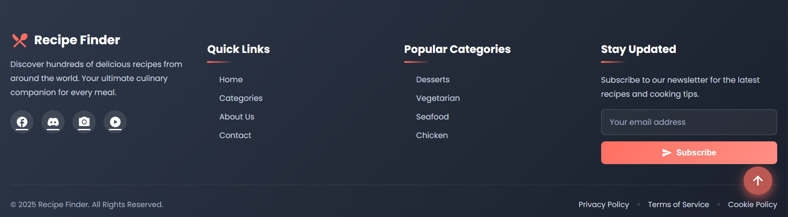

# 🍳 Recipe Finder

A modern, responsive web application built with Angular that helps users discover and explore delicious recipes from cuisines around the world. Search by category, ingredients, or cuisine type, and get detailed cooking instructions with video tutorials.


## ✨ Features

- 🔍 **Smart Search** - Search recipes by name, category, or cuisine
- 🌍 **Multiple Cuisines** - Explore recipes from Italian, Chinese, Mexican, and more
- 📱 **Responsive Design** - Seamless experience across desktop, tablet, and mobile
- 🎥 **Video Tutorials** - Watch step-by-step cooking videos
- ✅ **Interactive Ingredients** - Check off ingredients as you cook
- 📋 **Detailed Instructions** - Clear, numbered cooking steps
- 💾 **Favorites** - Save your favorite recipes (coming soon)
- 🎨 **Modern UI** - Beautiful gradient design with smooth animations
- ⬆️ **Back to Top** - Easy navigation with scroll-to-top button
- 🔒 **SEO Optimized** - Meta tags for better search engine visibility

## 🚀 Live Demo

[View Live Demo](https://recipe-finder-seven-roan.vercel.app/)

## 📸 Screenshots








## 🛠️ Technologies Used

- **Framework**: Angular 19.0.0
- **Language**: TypeScript 5.6.3
- **Styling**: SCSS with CSS Variables
- **HTTP Client**: RxJS for reactive programming
- **Icons**: Material Icons
- **Font**: Google Fonts (Poppins)
- **API**: [TheMealDB API](https://www.themealdb.com/api.php)
- **Build Tool**: Angular CLI with esbuild
- **Deployment**: Vercel

## 📋 Prerequisites

Before you begin, ensure you have the following installed:

- [Node.js](https://nodejs.org/) (v18 or higher)
- [npm](https://www.npmjs.com/) (v9 or higher)
- [Angular CLI](https://angular.io/cli) (v19 or higher)

```bash
npm install -g @angular/cli
```

## 🔧 Installation

1. **Clone the repository**

```bash
git clone https://github.com/Emtiaz01/recipe-finder.git
cd recipe-finder
```

2. **Install dependencies**

```bash
npm install
```

3. **Run the development server**

```bash
npm start
```

or

```bash
ng serve
```

4. **Open your browser**

Navigate to `http://localhost:4200/`

## 📦 Build

To build the project for production:

```bash
npm run build
```

The build artifacts will be stored in the `dist/` directory.

## 🧪 Running Tests

### Unit Tests

```bash
npm test
```

### End-to-End Tests

```bash
npm run e2e
```

## 📁 Project Structure

```
recipe-finder/
├─ src/
│  ├─ app/
│  │  ├─ components/          # Reusable components
│  │  │  ├─ back-to-top/      # Scroll to top button
│  │  │  ├─ favorites/        # Favorites list
│  │  │  ├─ recipe-details/   # Recipe detail view
│  │  │  ├─ recipe-list/      # Recipe grid/list
│  │  │  └─ search-bar/       # Search component
│  │  ├─ pages/               # Page components
│  │  │  ├─ about/            # About page
│  │  │  ├─ categories/       # Categories page
│  │  │  ├─ contact/          # Contact page
│  │  │  ├─ cookie-policy/    # Cookie policy
│  │  │  ├─ home/             # Home page
│  │  │  ├─ privacy-policy/   # Privacy policy
│  │  │  ├─ search-results/   # Search results
│  │  │  └─ terms-of-service/ # Terms of service
│  │  ├─ services/            # API services
│  │  │  ├─ recipe.ts         # Recipe API service
│  │  │  └─ favorites.service.ts
│  │  ├─ models/              # TypeScript interfaces
│  │  │  └─ recipe.model.ts
│  │  ├─ pipes/               # Custom pipes
│  │  │  └─ safe.pipe.ts      # URL sanitization
│  │  ├─ utils/               # Utility functions
│  │  │  ├─ ingredient-extractor.ts
│  │  │  └─ recipe-mapper.ts
│  │  ├─ app.routes.ts        # Route configuration
│  │  └─ app.config.ts        # App configuration
│  ├─ screenshots/            # Static screenshots
│  ├─ styles.scss             # Global styles
│  └─ index.html              # HTML entry point
├─ angular.json               # Angular configuration
├─ package.json               # Dependencies
└─ tsconfig.json              # TypeScript configuration
```

## 🎨 Styling

The application uses a modern design system with:

- **Color Palette**: Purple gradient theme (`#667eea` to `#764ba2`)
- **Typography**: Poppins font family
- **Components**: Material Design inspired
- **Responsive**: Mobile-first approach with breakpoints at 480px, 768px, and 1024px

### CSS Variables

```scss
--primary-color: #ff6f61;
--purple-primary: #667eea;
--gradient-primary: linear-gradient(135deg, #667eea 0%, #764ba2 100%);
--border-radius-small: 10px;
--border-radius-medium: 12px;
```

## 🌐 API Integration

This project uses [TheMealDB API](https://www.themealdb.com/api.php) for recipe data.

**Key Endpoints:**
- `/search.php?s={term}` - Search recipes
- `/filter.php?c={category}` - Filter by category
- `/lookup.php?i={id}` - Get recipe details
- `/categories.php` - Get all categories

## 🔐 Security

- URL sanitization using `DomSanitizer` for embedded content
- Input validation for search queries
- Error handling for API requests

## 🚢 Deployment

### Deploy to Vercel

1. Push your code to GitHub
2. Import project in Vercel
3. Configure build settings:
   - **Build Command**: `npm run build`
   - **Output Directory**: `dist/recipe-finder/browser`
4. Deploy!

### Environment Variables (if needed)

```
# Add any environment-specific variables here
API_URL=https://www.themealdb.com/api/json/v1/1
```

## 🤝 Contributing

Contributions are welcome! Please follow these steps:

1. Fork the repository
2. Create a feature branch (`git checkout -b feature/AmazingFeature`)
3. Commit your changes (`git commit -m 'Add some AmazingFeature'`)
4. Push to the branch (`git push origin feature/AmazingFeature`)
5. Open a Pull Request

## 📝 License

This project is licensed under the MIT License - see the [LICENSE](LICENSE) file for details.

## 👨‍💻 Author

**Emtiaz**
- GitHub: [@Emtiaz01](https://github.com/Emtiaz01)

## 🙏 Acknowledgments

- [TheMealDB](https://www.themealdb.com/) for providing the recipe API
- [Angular](https://angular.io/) for the amazing framework
- [Material Icons](https://fonts.google.com/icons) for the icon library
- [Google Fonts](https://fonts.google.com/) for the Poppins font

## 📞 Support

If you have any questions or need help, feel free to:
- Open an issue on GitHub
- Contact via email: emtiuz.emon@gmail.com

---

⭐ **Star this repo if you find it helpful!**

Made with ❤️ using Angular